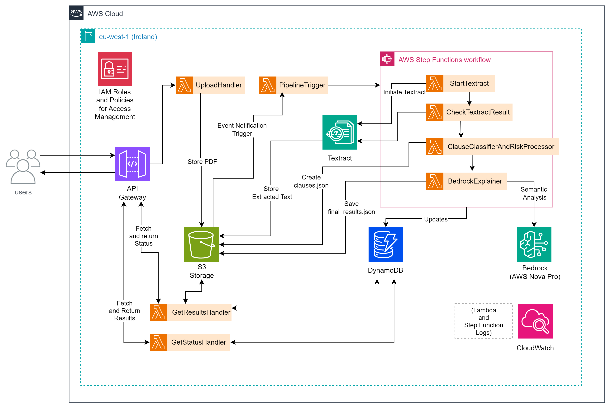
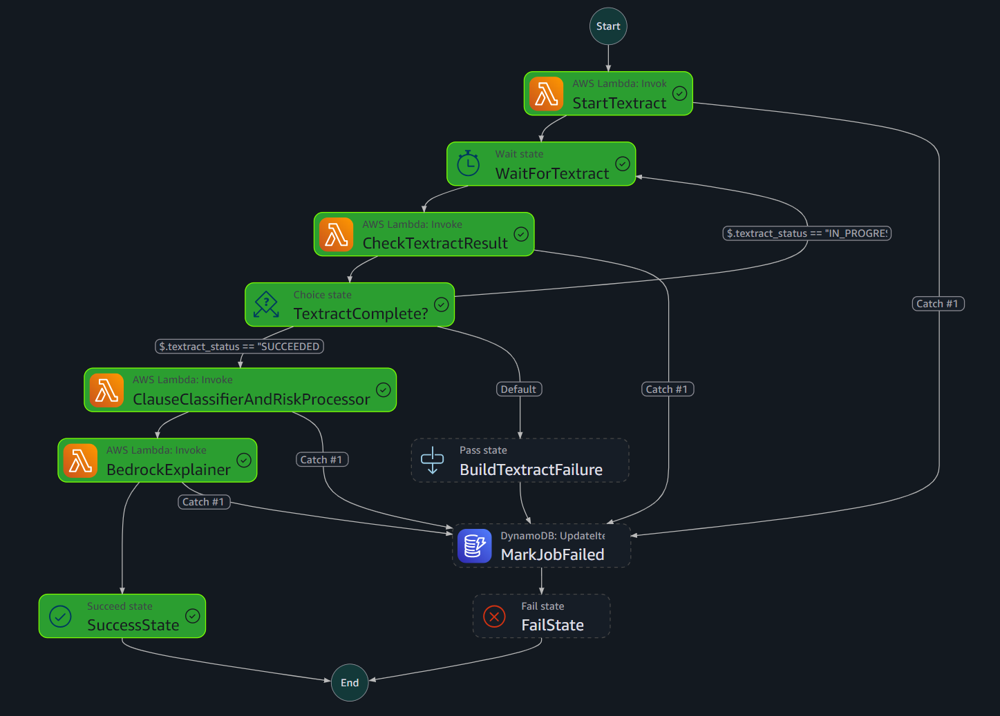

# AWS AI Contract Review

A serverless application that turns PDF contracts into structured clause analysis, risk assessments, and plain-English explanations using Amazon Textract and Amazon Bedrock.

The completed workflow handles document upload, asynchronous processing, AI analysis, and result retrieval. This repository contains the Python Lambda functions, the Step Functions workflow definition, a saved analysis result, and screenshots from the AWS implementation.

**Stack:** Python · Boto3 · API Gateway · S3 · Lambda · Step Functions · Textract · Bedrock · DynamoDB · CloudWatch

[Source code](code%20files/) · [Sample analysis](code%20files/final_results.json) · [Project report](25138928_Ghanmode_ShubhamYashwant.pdf) · [Screenshots](screenshots/)

## Features

- **Direct PDF uploads** through time-limited, presigned S3 URLs.
- **Asynchronous text extraction** with Textract and a Step Functions polling loop.
- **Clause preprocessing** that splits extracted text and assigns preliminary keyword-based labels and risk flags.
- **AI-assisted review** that uses Bedrock to assess clause wording, explain risks, quote supporting text, and generate a summary.
- **Job tracking** through `PENDING`, `PROCESSING`, `COMPLETE`, and `FAILED` states in DynamoDB.
- **Traceable results** with clause-level findings, model and prompt identifiers, a generation timestamp, and the workflow execution ARN.
- **Failure handling** that routes processing errors to a DynamoDB status update before terminating the workflow.

## Architecture



[Open the full diagram](aws_architecture.drawio.png) · [Editable Draw.io source](aws_architecture.drawio)

The diagram gives the service-level overview. In the exported code, clients upload directly to S3 using a presigned URL, and `GetResultsHandler` reads the summary and result key from DynamoDB; clients retrieve the detailed JSON from S3 separately.

### Processing flow

1. A client requests an upload URL through API Gateway. `UploadHandler` creates a job record and returns a job ID and presigned URL.
2. The client uploads the PDF directly to S3. An object-created event invokes `PipelineTrigger`, which marks the job as `PROCESSING` and starts the workflow.
3. `StartTextract` submits the document for text extraction. Step Functions waits 20 seconds between status checks until extraction finishes.
4. `CheckTextractResult` retrieves all result pages and saves the Textract response and extracted text to S3.
5. `ClauseClassifierAndRiskProcessor` prepares structured clauses with preliminary classifications and risk flags.
6. `BedrockExplainer` sends clause text and preliminary metadata to Bedrock through the Converse API. It saves the final analysis to S3 and updates DynamoDB with the summary, risk counts, and `COMPLETE` status.
7. The client uses the status and results endpoints to retrieve job progress and the result location.

The rule-based stage supplies initial hints; Bedrock is prompted to assess the actual wording. No custom model training is involved.

### Completed workflow

The captured execution below shows the successful path through text extraction, clause preprocessing, and Bedrock analysis. The workflow also defines a shared failure path through `MarkJobFailed`.



Workflow definition: [ContractReviewPipeline.json](code%20files/ContractReviewPipeline.json)

## Repository structure

```text
.
├── code files/
│   ├── UploadHandler.py
│   ├── PipelineTrigger.py
│   ├── StartTextract.py
│   ├── CheckTextractResult.py
│   ├── ClauseClassifierAndRiskProcessor.py
│   ├── BedrockExplainer.py
│   ├── GetStatusHandler.py
│   ├── GetResultsHandler.py
│   ├── ContractReviewPipeline.json
│   └── final_results.json
├── screenshots/
├── sample-contract.md
├── sample-contract.pdf
├── aws_architecture.drawio
├── aws_architecture.drawio.png
├── 25138928_Ghanmode_ShubhamYashwant.pdf
├── .gitignore
└── README.md
```

| Component | Responsibility |
| --- | --- |
| [UploadHandler](code%20files/UploadHandler.py) | Generates a job ID and upload URL; creates the initial DynamoDB record. |
| [PipelineTrigger](code%20files/PipelineTrigger.py) | Starts processing when a contract arrives in S3. |
| [StartTextract](code%20files/StartTextract.py) | Starts asynchronous PDF text extraction. |
| [CheckTextractResult](code%20files/CheckTextractResult.py) | Polls extraction status, follows pagination, and stores extracted text. |
| [ClauseClassifierAndRiskProcessor](code%20files/ClauseClassifierAndRiskProcessor.py) | Splits text into clauses and applies deterministic preprocessing rules. |
| [BedrockExplainer](code%20files/BedrockExplainer.py) | Generates semantic analysis and explanations, stores results, and completes the job. |
| [GetStatusHandler](code%20files/GetStatusHandler.py) | Returns the job ID and current status. |
| [GetResultsHandler](code%20files/GetResultsHandler.py) | Returns the summary, high/medium risk counts, status, and S3 result key from DynamoDB. |

## API

| Method | Route | Response |
| --- | --- | --- |
| `POST` | `/upload-url` | `job_id`, `upload_url`, `s3_key` |
| `GET` | `/status/{jobId}` | `job_id`, `status` |
| `GET` | `/results/{jobId}` | `job_id`, `status`, `summary`, `results_s3_key`, `high_risk_count`, `medium_risk_count` |

The upload endpoint accepts a JSON body such as `{"filename":"sample-contract.pdf"}`. The subsequent S3 upload must use `Content-Type: application/pdf`, matching the signed URL.

The results endpoint returns a compact DynamoDB summary. Detailed clause findings are stored in the S3 object identified by `results_s3_key`. Result fields can be `null` while a job is still pending or processing.

### Example request sequence

Run these commands in PowerShell against your deployed API, with the sample PDF in the current directory:

```powershell
$apiBase = "https://<api-id>.execute-api.<region>.amazonaws.com"

# Request an upload URL and create the job.
$upload = Invoke-RestMethod -Method Post -Uri "$apiBase/upload-url" -ContentType "application/json" -Body '{"filename":"sample-contract.pdf"}'

# Upload the PDF; the S3 event starts processing automatically.
Invoke-WebRequest -Method Put -Uri $upload.upload_url -ContentType "application/pdf" -InFile ".\sample-contract.pdf"

# Check progress. Repeat until the status is COMPLETE or FAILED.
Invoke-RestMethod -Uri "$apiBase/status/$($upload.job_id)"

# Retrieve the result summary after completion.
$result = Invoke-RestMethod -Uri "$apiBase/results/$($upload.job_id)"
$result
```

To download the complete analysis using an AWS CLI profile with access to the bucket:

```powershell
$bucketName = "<your-contract-bucket>"
aws s3 cp "s3://$bucketName/$($result.results_s3_key)" ".\analysis-result.json"
```

## Stored outputs

One S3 bucket holds both the original document and its processing artifacts, grouped by job ID:

```text
uploads/<job_id>/contract.pdf
processed/<job_id>/textract.json
processed/<job_id>/raw_text.txt
processed/<job_id>/clauses.json
processed/<job_id>/final_results.json
```

The final JSON contains the contract summary, returned clause analyses, flagged clauses, high/medium risk counts, and analysis metadata. Each clause result can include its original text, preliminary and final classifications, severity, risk rationale, supporting excerpt, explanation, confidence value, and review flag.

### Saved analysis example

The included [final_results.json](code%20files/final_results.json) records a completed software services agreement analysis:

| Field | Recorded value |
| --- | --- |
| Job status | `COMPLETE` |
| Bedrock model/profile identifier | `eu.amazon.nova-pro-v1:0` |
| Preprocessing method | `heuristic_rules_v1` |
| AI analysis method | `bedrock_semantic_analysis` |
| Returned clause analyses | 6 |
| High-risk findings | 0 |
| Medium-risk findings | 5 |
| Clauses marked for review | 6 |

These counts describe the saved model output, not every clause in the input contract. The implementation sends at most the first 20 preprocessed clauses by default, controlled by `MAX_CLAUSES_FOR_BEDROCK`; the saved response contains six clause analyses. A `COMPLETE` status indicates that processing finished, not that every contract clause was reviewed.

## AWS configuration

The implementation was deployed in `eu-west-1`. The repository contains function source and an exported workflow definition; AWS resources and IAM policies are configured separately.

The runtime uses Python and Boto3. Each source file exposes `lambda_handler`; when retaining its filename, use a handler such as `UploadHandler.lambda_handler`.

| Environment variable | Used by | Value / default |
| --- | --- | --- |
| `BUCKET_NAME` | `UploadHandler` | S3 bucket for uploaded contracts and processing outputs. |
| `TABLE_NAME` | Upload, trigger, status, results, and Bedrock functions | DynamoDB table; the workflow export uses `ContractAnalysisJobs` with string partition key `job_id`. Optional in the Textract and preprocessing functions. |
| `STATE_MACHINE_ARN` | `PipelineTrigger` | ARN of the contract processing state machine. |
| `BEDROCK_MODEL_ID` | `BedrockExplainer` | Accessible Converse-compatible model or inference profile. The saved output records `eu.amazon.nova-pro-v1:0`. |
| `UPLOAD_URL_EXPIRY_SECONDS` | `UploadHandler` | `900` |
| `CLAUSE_MIN_CHARS` | `ClauseClassifierAndRiskProcessor` | `60` |
| `PRELIMINARY_ANALYSIS_METHOD` | `ClauseClassifierAndRiskProcessor` | `heuristic_rules_v1` |
| `PRELIMINARY_ANALYSIS_MODEL_ID` | `ClauseClassifierAndRiskProcessor` | `none_rule_based` |
| `MAX_CLAUSES_FOR_BEDROCK` | `BedrockExplainer` | `20` |
| `BEDROCK_ANALYSIS_PROMPT_VERSION` | `BedrockExplainer` | `v1` |
| `SUMMARY_PROMPT_VERSION` | `BedrockExplainer` | `v1` |

When deploying to another account, replace the Lambda ARNs and DynamoDB table name in the workflow export, then configure the environment variables for that deployment. Connect the three API routes to their handlers and restrict the S3 object-created trigger to the `uploads/` prefix so generated outputs do not restart the pipeline.

Execution roles need access to the services used by their functions: S3, DynamoDB, Textract, Bedrock inference, Step Functions execution, and CloudWatch logging. The state machine role invokes the processing Lambdas and updates DynamoDB on failure. Set function timeouts to accommodate extraction-result retrieval and model inference.

## Implementation evidence

The [screenshots directory](screenshots/) preserves captures from implementation and testing:

| Evidence | What it shows |
| --- | --- |
| [Final workflow execution](screenshots/updated_day3_state_machine_graph_view.png) | Successful execution through the Bedrock stage. |
| [DynamoDB processing record](screenshots/dbtable_showing_processing.png) | Job state during processing. |
| [Status API call](screenshots/get_status_curl.png) | An early API response with `PENDING` status. |
| [Results API call](screenshots/get_results_curl.png) | The response shape before completion, with result fields still `null`. |
| [Textract timeout capture](screenshots/state_machine_CheckTextractResult_timeout_error.png) | A processing timeout captured during development. |
| [Saved final output](code%20files/final_results.json) | Completed analysis, clause findings, and model metadata. |

The sample contract is available as [PDF](sample-contract.pdf) and [Markdown](sample-contract.md). It includes deliberately varied contract terms for exercising the review workflow. Generated findings support human review and are not legal advice.

For the design rationale, model discussion, and scalability considerations, see the [final project report](25138928_Ghanmode_ShubhamYashwant.pdf).
